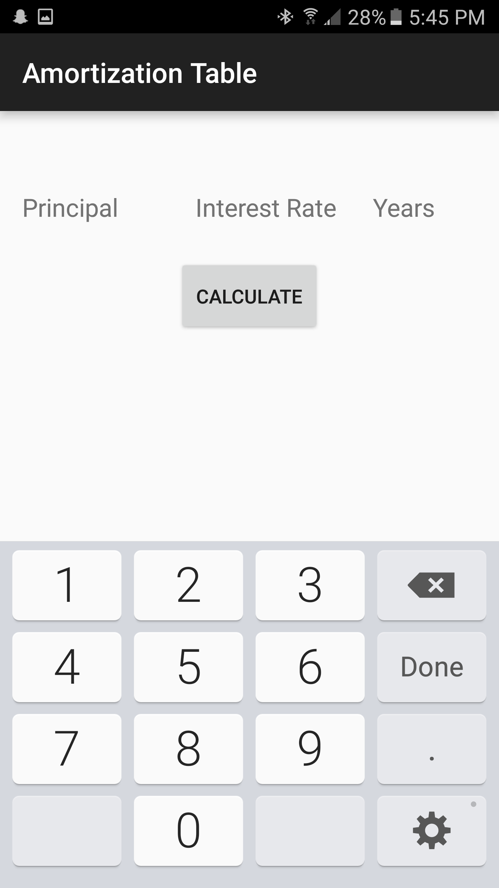
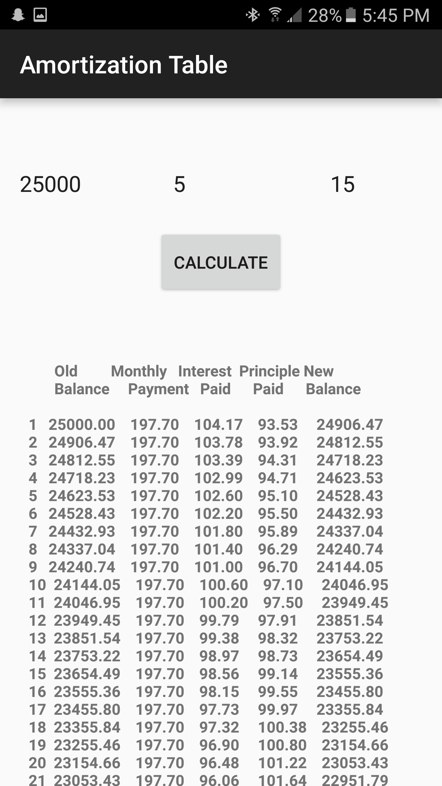

# AmortizationTable
<h2> Screeshoot </h2>=

 Amortization table takes 3 inputs: Principal amount owed, Interest Rate, and Years 

 

 When you press calculate, a list of payments are displayed to the user 

